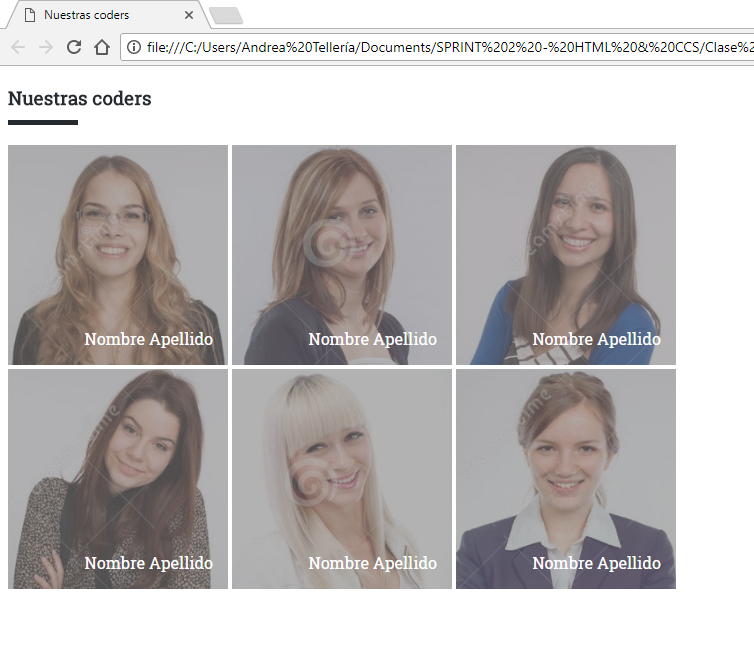

## Nuestras Coders

#### Descripción:
Este repositorio contiene un ejercicio práctico donde hemos posicionado imágenes en el flujo de nuestro documento. En CSS hemos utilizado positioning, la propiedad filter de la etiqueta img, entre otros.

El documento se mostrará de la siguiente manera en el navegador:

  

#### Herramientas utilizadas:
* HTML
* CSS
